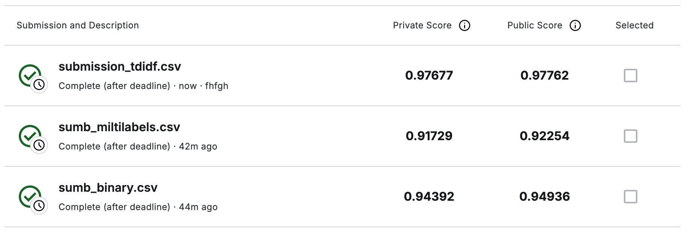

# lightautoml_course

Соревнование: https://www.kaggle.com/competitions/jigsaw-toxic-comment-classification-challenge/overview

Как видно из результатов ниже, победил подход основанных на TF-IDF + Logreg

На втором месте подход на lightautoml с бинарной классификацией, на третьем lightautoml с методом multilables. 

